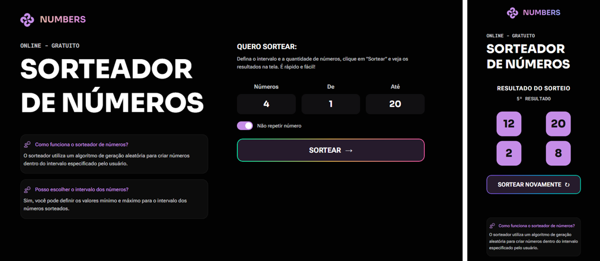

<h1 align="center"> 🎲 Numbers — Sorteador de Números </h1>

  

Aplicação web para sorteio de números aleatórios, com controle de intervalo, opção de não repetição, animação visual e histórico limitado de resultados.

  <a href="#-projeto">Projeto</a>&nbsp;&nbsp;&nbsp;|&nbsp;&nbsp;&nbsp;
  <a href="#-funcionalidades">Funcionalidades</a>&nbsp;&nbsp;&nbsp;|&nbsp;&nbsp;&nbsp;
  <a href="#-tecnologias">Tecnologias</a>&nbsp;&nbsp;&nbsp;|&nbsp;&nbsp;&nbsp;
  <a href="#-aprendizados">Aprendizados</a>

---

## 📌 Projeto

O **Numbers** é um sorteador de números online desenvolvido com **HTML, CSS e JavaScript puro**, focado em:

- boa experiência visual
- lógica clara e validada
- animação progressiva dos resultados
- organização de código e boas práticas

O usuário define:
- quantidade de números
- valor mínimo e máximo
- se os números podem ou não se repetir

Após o sorteio, os resultados são exibidos com **animação sequencial**, simulando uma roleta visual, e um contador indica o número do sorteio realizado.

---

## ⚙️ Funcionalidades

- 🎯 Sorteio de números inteiros aleatórios
- 🔁 Opção de permitir ou impedir repetição
- 🚨 Validações de entrada (intervalo inválido, quantidade maior que o intervalo)
- 🎞️ Animação visual dos números sendo revelados
- ⏱️ Revelação sequencial (um número por vez)
- 🧮 Contador de sorteios (1º, 2º, 3º…)
- 🔄 Botão “Sortear novamente”
- 📱 Layout responsivo (mobile e desktop)

---

## 🧠 Lógica de funcionamento

- Geração de números com `Math.random()` + `Math.floor()`
- Controle de repetição usando `Array.includes()`
- Criação dinâmica dos slots via `document.createElement`
- Animação controlada por classes CSS (`.is-done`)
- Revelação sequencial com `async / await` e `Promise (sleep)`
- Separação clara entre:
  - lógica do sorteio
  - manipulação da interface
  - animação

---

## 🛠️ Tecnologias

- **HTML5** — estrutura semântica
- **CSS3**
  - Grid e Flexbox
  - animações com `@keyframes`
  - gradientes e estados visuais
- **JavaScript (Vanilla)**
  - manipulação do DOM
  - arrays, loops e validações
  - funções assíncronas (`async / await`)

---

## 📚 Aprendizados

Neste projeto foram praticados conceitos fundamentais de front-end:

- organização e leitura de código JavaScript
- separação de responsabilidades (lógica × UI)
- criação dinâmica de elementos no DOM
- controle de estado da aplicação
- uso consciente de `const`, `let` e funções assíncronas
- refinamento visual com CSS sem bibliotecas externas

---

## 🚀 Status do projeto

✅ Concluído  
🔧 Aberto para melhorias visuais e novas animações

---

Desenvolvido como projeto de estudo e prática em front-end.

